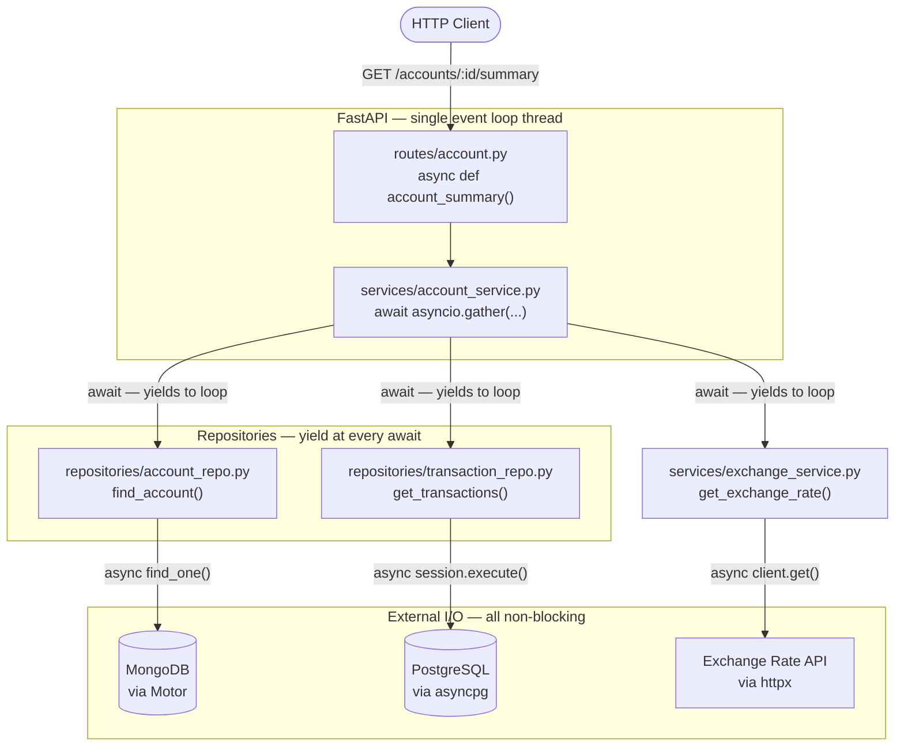
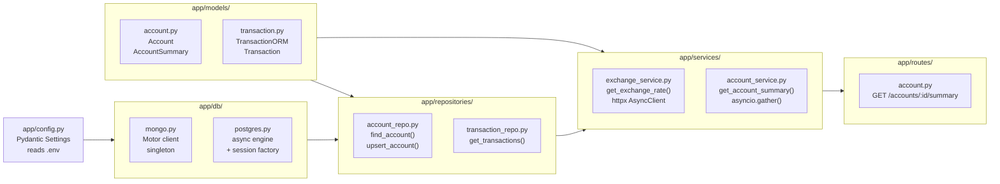
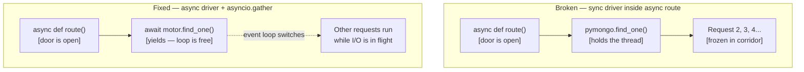
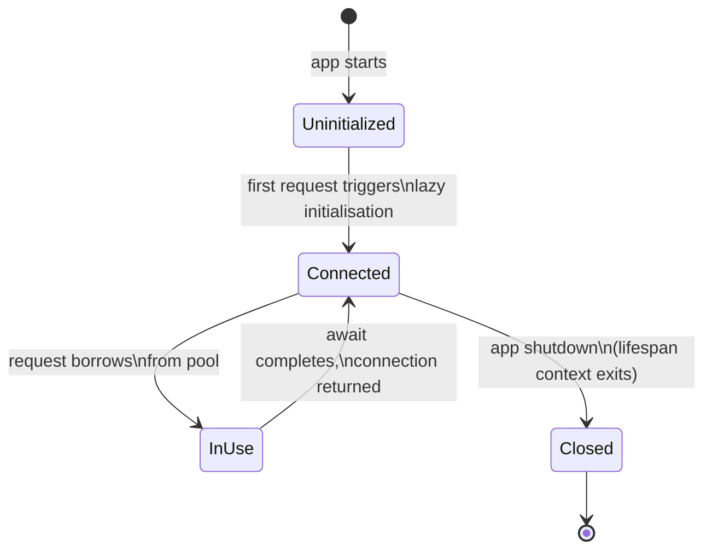

# Architecture

## Request Flow



## Module Layout



## Concurrency Model: What the Event Loop Sees

```mermaid
sequenceDiagram
    participant Loop as Event Loop
    participant Req as Request Handler
    participant Mongo as Motor (MongoDB)
    participant PG as asyncpg (PostgreSQL)
    participant HTTP as httpx (Exchange API)

    Req->>Loop: asyncio.gather(mongo, pg, http)
    Loop->>Mongo: find_one() — send query, yield
    Loop->>PG: execute() — send query, yield
    Loop->>HTTP: GET /live — send request, yield

    Note over Loop: Loop is FREE while all 3 are in flight.<br/>Other incoming requests run here.

    Mongo-->>Loop: result ready
    PG-->>Loop: result ready
    HTTP-->>Loop: result ready

    Loop-->>Req: all 3 resolved → assemble response
```

## Broken vs Fixed: The Corridor Analogy



## Connection Lifecycle


